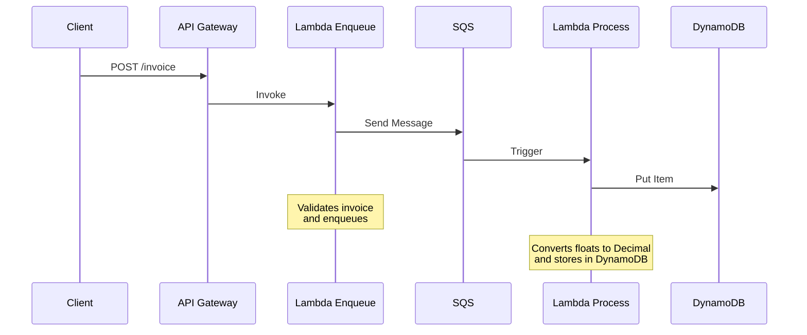

# Invoice Processor

Sistema de procesamiento de facturas usando AWS Lambda, SQS y DynamoDB.

## Arquitectura



## Flujo de Datos

1. **Cliente → API Gateway**
   - El cliente envía una factura en formato JSON
   - URL: `https://usz5xhjj03.execute-api.eu-west-1.amazonaws.com/prod/invoice`

2. **API Gateway → Lambda Enqueue**
   - API Gateway invoca la función Lambda `enqueue-invoice`
   - La función valida la factura
   - Si es válida, la envía a SQS

3. **Lambda Enqueue → SQS**
   - La factura se encola en SQS
   - Se genera un MessageId único

4. **SQS → Lambda Process**
   - SQS dispara automáticamente la función Lambda `process-invoice`
   - La función recibe el mensaje de SQS

5. **Lambda Process → DynamoDB**
   - Convierte los números float a Decimal
   - Almacena la factura en DynamoDB
   - Incluye timestamp de procesamiento

## Estructura de Datos

### Factura de Entrada
```json
{
    "invoice_id": "INV-001",
    "customer_name": "Cliente de Prueba",
    "items": [
        {
            "description": "Producto 1",
            "quantity": 2,
            "price": 10.00
        }
    ],
    "total": 35.50
}
```

### En DynamoDB
```json
{
    "invoice_id": "INV-001",
    "customer_name": "Cliente de Prueba",
    "items": [
        {
            "description": "Producto 1",
            "quantity": 2,
            "price": "10.00"  // Decimal
        }
    ],
    "total": "35.50",  // Decimal
    "processed_at": "1234567890"  // Timestamp en milisegundos
}
```

## Requisitos

- Python 3.12
- AWS CLI
- Terraform
- zip

## Instalación

1. Clonar el repositorio
2. Instalar dependencias:
   ```bash
   pip install -r requirements.txt
   ```
3. Configurar AWS CLI
4. Ejecutar Terraform:
   ```bash
   cd terraform
   terraform init
   terraform apply
   ```

## Uso

Para enviar una factura:
```bash
curl -X POST https://usz5xhjj03.execute-api.eu-west-1.amazonaws.com/prod/invoice \
  -H "Content-Type: application/json" \
  -d '{
    "invoice_id": "INV-001",
    "customer_name": "Cliente de Prueba",
    "items": [
      {
        "description": "Producto 1",
        "quantity": 2,
        "price": 10.00
      }
    ],
    "total": 35.50
  }'
``` 